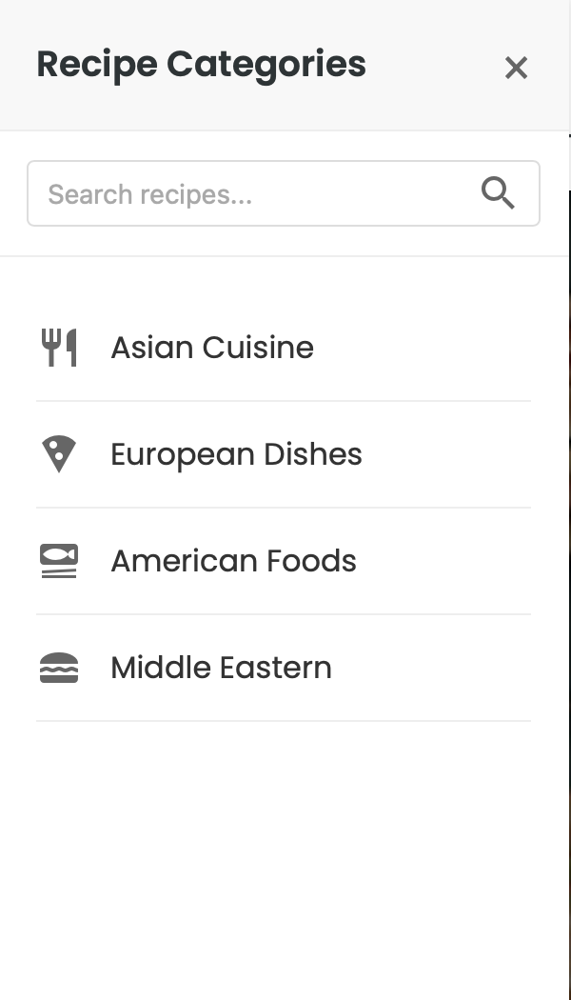
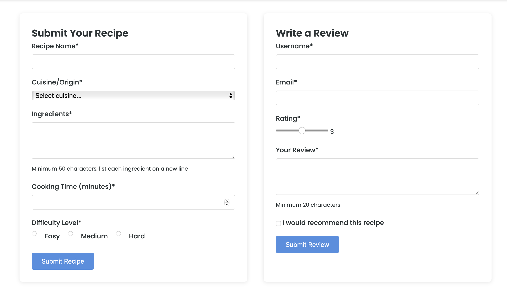
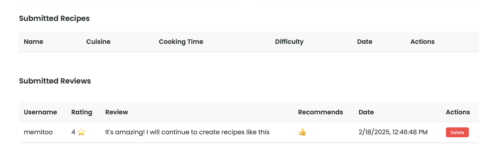

# Project Implementation Briefing

## Q1. Dynamic Menu Bar with JavaScript (4 Marks)

### Implementation Details

- File: `js/menu.js`
- Related Files: `index.html`, `styles/main.css`

The dynamic menu bar was implemented as a sliding side panel that appears on click and includes:

- Category filtering
- Search functionality
- Smooth animations
- Mobile responsiveness

Key Code Sections

```javascript
// filepath: /Users/mehmetb/Desktop/notes/s2025/een1037/project/js/menu.js
document.addEventListener("DOMContentLoaded", () => {
  const menuToggle = document.getElementById("menuToggle");
  const sideMenu = document.getElementById("sideMenu");

  // Menu toggle functionality (Lines 5-15)
  menuToggle.addEventListener("click", () => {
    sideMenu.classList.toggle("active");
  });
});
```

### Visual Implementation



## Q2. Form Data Validation (4 Marks)

### Implementation Details

- **File**: `js/forms.js`
- **Related Files**: `recipes.html`

Form validation includes:

- Real-time validation
- Custom error messages
- Pattern matching
- Required field checking

### Key Code Sections

```javascript
// filepath: /Users/mehmetb/Desktop/notes/s2025/een1037/project/js/forms.js
const validateForm = (form) => {
  let isValid = true;
  const inputs = form.querySelectorAll("input, select, textarea");

  // Validation logic (Lines 45-70)
  inputs.forEach((input) => {
    if (!input.checkValidity()) {
      isValid = false;
      showError(input);
    }
  });

  return isValid;
};
```

### Visual Implementation



## Q3. Form Data Local Storage (4 Marks)

### Implementation Details

- **File**: `js/forms.js`
- **Related Files**: `recipes.html`

Local storage implementation includes:

- Data persistence
- CRUD operations
- Dynamic table updates
- JSON data handling

### Key Code Sections

```javascript
// filepath: /Users/mehmetb/Desktop/notes/s2025/een1037/project/js/forms.js
// Initialize storage (Lines 10-11)
let recipes = JSON.parse(localStorage.getItem("recipes") || "[]");
let reviews = JSON.parse(localStorage.getItem("reviews") || "[]");

// Storage update example (Lines 80-85)
reviews.push(reviewData);
localStorage.setItem("reviews", JSON.stringify(reviews));
```

### Visual Implementation



## Q4. Event Capturing and Handling (3 Marks)

### Implementation Details

- **File**: `js/events.js`
- **Related Files**: `index.html`, `recipes.html`

Implemented events include:

- Right-click context menu
- Hover effects
- Form focus/blur events

### Key Code Sections

```javascript
// filepath: /Users/mehmetb/Desktop/notes/s2025/een1037/project/js/events.js
// Right-click event (Lines 15-25)
recipeCards.forEach((card) => {
  card.addEventListener("contextmenu", (e) => {
    e.preventDefault();
    // Custom context menu logic
  });
});

// Hover events (Lines 30-40)
ingredientsField.addEventListener("mouseover", (e) => {
  // Tooltip display logic
});
```

### Visual Implementation

## Technical Requirements Met

- ✅ Dynamic menu bar with search and categories
- ✅ Form validation with real-time feedback
- ✅ Local storage implementation
- ✅ Multiple event types handled
- ✅ Responsive design
- ✅ Cross-browser compatibility

## Browser Testing

Tested successfully on browsers
